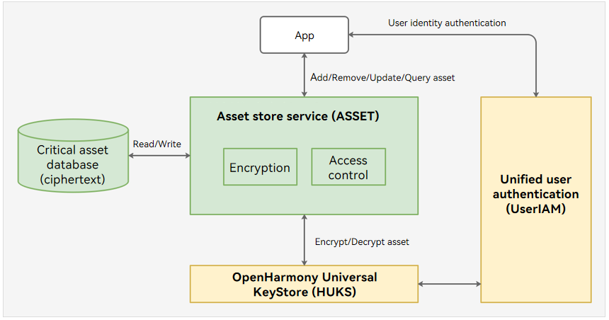

# ASSET

## Introduction

The asset store service (ASSET) provides secure storage and management of sensitive data less than 1024 bytes in size, including passwords, app tokens, and other critical data (such as bank card numbers).

The following figure shows the ASSET architecture.



An application can perform the following operations using ASSET:

- Adding an asset: ASSET generates a unique key for the application, uses the key to encrypt the asset, and stores the encrypted asset in the database.
- Updating an asset: ASSET encrypts the new asset using the unique key of the application and updates the data in the database.
- Querying an asset: ASSET obtains the asset ciphertext from the database based on the query conditions specified, verifies the access permission of the application, uses the unique key of the application to decrypt the asset ciphertext, and returns the plaintext to the application.
- Removing an asset: ASSET removes the asset that matches the specified conditions.

The secure storage of assets depends on the underlying HUKS. Specifically, HUKS implements the asset encryption, decryption, and access control in a secure environment (such as a TEE). The sensitive user data will never be disclosed even if the system is attacked.

For the scenarios demanding higher security, ASSET allows access to assets only after a successful user identity authentication. Before accessing assets that require identity access control, an application needs to launch a user prompt for user identity authentication (PIN, fingerprint, or facial authentication). After the application sends the user authentication result to ASSET, ASSET invokes HUKS to verify the authentication result. If the verification is successful, HUKS decrypts the asset in a secure environment and returns the plaintext.

With the APIs provided by ASSET, you can quickly integrate system-wide encrypted storage and access control mechanisms for short sensitive data.

## Directory Structure

```bash
├── frameworks              # Framework code
│   ├── c                   # Code for interaction between C and Rust
│   ├── definition          # Definitions of common data types
│   ├── ipc                 # IPC APIs
│   ├── js                  # Code for interaction between JS and C/C++
│   ├── os_dependency       # Adaptation of universal system capabilities
│   └── utils               # Utility APIs
├── interfaces              # APIs exposed externally
│   ├── inner_kits          # APIs for system abilities (SAs)
│   └── kits                # APIs for user applications
├── sa_profile              # SA profiles
└── services                # Service layer code
    ├── constants           # Constants of the service layer
    ├── core_service        # Core service module
    ├── crypto_manager      # Data encryption/decryption module
    ├── db_key_operator     # Database key management module
    ├── db_operator         # Data management module
    └── os_dependency       # System capability adaptation module
```

## Build

The following uses rk3568 as an example.

```bash
# Build the source code of the module.
./build.sh --product-name rk3568 --ccache --build-target asset

# Build the test code of the module.
./build.sh --product-name rk3568 --ccache --build-target asset_bin_test
```

## Usage
### Available APIs

[API reference](https://gitcode.com/openharmony/docs/blob/master/en/application-dev/reference/apis-asset-store-kit/Readme-EN.md)

### Development Guide

[Development guide](https://gitcode.com/openharmony/docs/blob/master/en/application-dev/security/AssetStoreKit/Readme-EN.md)

## Repositories Involved
**[HUKS](https://gitcode.com/openharmony/security_huks)**

**[UserIAM](https://gitcode.com/openharmony/useriam_user_auth_framework)**
