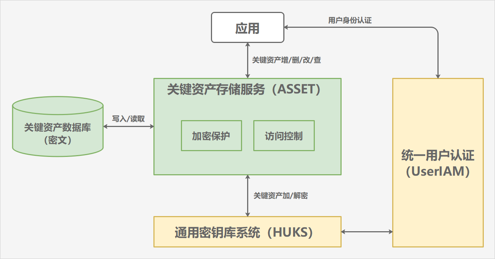

# 关键资产存储服务(ASSET)

## 简介

关键资产存储服务(ASSET)，提供了用户短敏感数据的安全存储及管理能力。其中，短敏感数据可以是密码类（账号/密码）、Token类（应用凭据）、其他关键明文（如银行卡号）等长度较短的用户敏感数据。

关键资产存储服务的架构如下图所示。



应用接入关键资产存储服务后，可以进行如下操作：

- 新增关键资产，ASSET 首先为应用生成独属于它的密钥，然后使用该密钥对关键资产进行加密，最后将关键资产密文存储到数据库。
- 更新关键资产，ASSET 使用新增阶段生成的密钥，对新的关键资产进行加密，并覆盖数据库中的相应记录。
- 查询关键资产，ASSET 首先根据应用指定的查询条件，从数据库中读取关键资产密文，然后校验应用的访问控制权限，验证通过后，使用新增阶段生成的密钥，对关键资产密文进行解密，最后将明文数据返回给应用。
- 删除关键资产，ASSET 根据应用指定的删除条件，从数据库中查找并删除符合条件的关键资产记录。

关键资产的安全存储，依赖底层的通用密钥库系统。具体来说，关键资产的加/解密操作以及访问控制校验，都由通用密钥库系统在安全环境（如可信执行环境）中完成，即使系统被攻破，也能保证用户敏感数据不发生泄露。

针对安全性要求更高的场景，ASSET 支持应用存储需要用户身份认证通过才允许访问的关键资产。具体来说，应用在读取此类关键资产时，需要先拉起统一用户认证服务，提示用户通过锁屏密码、指纹、人脸等方式进行身份认证；应用将用户身份认证结果传递给 ASSET 后，ASSET 会请求通用密钥库系统，在安全环境校验认证结果，验证通过后才继续在安全环境解密关键资产。

使用关键资产存储服务提供的接口，开发者可以快速集成平台级别、面向短敏感数据的加密存储和访问控制机制，帮助用户方便、安全地管理密码等数据。

## 目录

```bash
├── frameworks              # 框架层代码
│   ├── definition          # 通用数据类型定义
│   ├── ipc                 # IPC接口定义
│   ├── js                  # JS-C/C++交互模块
│   ├── os_dependency       # 通用系统能力适配模块
│   └── utils               # 工具方法
├── interfaces              # 对外提供的接口
│   ├── inner_api           # 提供给系统服务调用的接口
│   └── kits                # 提供给应用调用的接口
├── sa_profile              # 系统服务配置文件
└── services                # 服务层代码
    ├── constants           # 服务层常量定义
    ├── core_service        # 核心处理模块
    ├── crypto_manager      # 数据加密模块
    ├── db_operator         # 数据管理模块
    └── os_dependency       # 系统能力适配模块
```

## 说明
### 接口说明

[JS API说明文档](./docs/reference/apis/js-apis-asset.md)

[C/C++ API说明文档](./docs/reference/native-apis/Readme-CN.md)

### 使用说明

[ArkTS开发指导](./docs/security/asset-js-guidelines.md)

[C/C++开发指导](./docs/security/asset-native-guidelines.md)

## 相关仓
**[通用密钥库系统（HUKS）](https://gitee.com/openharmony/security_huks)**

**[统一用户认证（UserIAM）](https://gitee.com/openharmony/useriam_user_auth_framework)**