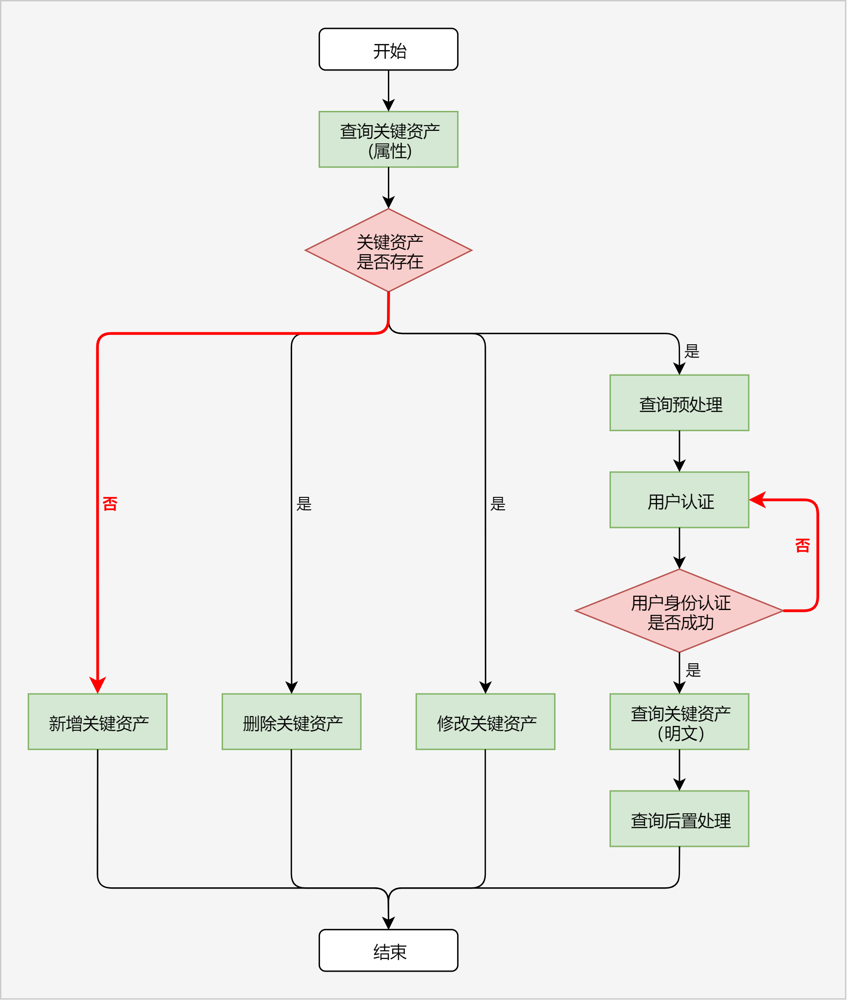

# 关键资产存储服务开发指导（ArkTS）

[toc]

## 场景1：保护密码类数据

> **说明：**
>
> 密码类数据可以是密码、登录令牌、信用卡号等用户敏感数据。

### 场景描述

用户在应用/浏览器中登录账号时，可以选择“记住密码”（如图）。针对此种场景，应用/浏览器可以将用户密码存储在ASSET中，由ASSET保证用户密码的安全性。

用户再次打开登录界面时，应用/浏览器可以从ASSET中查询用户密码，并将其自动填充到密码输入框，用户只需点击“登录”按钮即可完成账号登录，极大地提升了用户体验。

 

### 关键流程

业务调用ASSET保护密码类数据（后文统称为“关键资产”），可以参照以下流程进行开发。

 

1. 业务查询符合条件的关键资产属性，根据查询成功/失败，判断关键资产是否存在。开发步骤参考[查询关键资产](#查询关键资产)，代码示例参考[查询单条关键资产属性](#查询单条关键资产属性)
2. 如果关键资产不存在，业务可选择：
    * 新增关键资产，开发步骤参考[新增关键资产](#新增关键资产)
3. 如果关键资产存在，业务可选择：
    * 删除关键资产，开发步骤参考[删除关键资产](#删除关键资产)
    * 更新关键资产，开发步骤参考[更新关键资产](#更新关键资产)
    * 查询关键资产明文，开发步骤参考[查询关键资产](#查询关键资产)，代码示例参考[查询单条关键资产明文](#查询单条关键资产明文)

## 场景2：保护需要用户身份认证的密码

### 场景描述

用户在金融/银行类应用中查看银行卡号时，需要核实用户身份为持卡人本人。针对此种场景，应用可以将银行卡号存储到ASSET中，同时设置访问银行卡号需要用户身份认证。

用户查看银行卡号时，应用请求用户进行身份认证（比如通过验证锁屏密码或生物特征），身份校验通过后，应用查询并向用户展示银行卡号，极大地提升了用户安全体验。

### 关键流程

业务调用ASSET保护需要用户身份认证的关键资产，可以参照以下流程进行开发。

 

1. 业务查询符合条件的关键资产属性，根据查询成功/失败，判断关键资产是否存在。开发步骤参考[查询关键资产](#查询关键资产)，代码示例参考[查询单条关键资产属性](#查询单条关键资产属性)
2. 如果关键资产不存在，业务可选择：
    * 新增关键资产，开发步骤参考[新增关键资产](#新增关键资产)
3. 如果关键资产存在，业务可选择：
    * 删除关键资产，开发步骤参考[删除关键资产](#删除关键资产)
    * 更新关键资产，开发步骤参考[更新关键资产](#更新关键资产)
    * 查询关键资产明文，开发步骤包括预处理、用户认证、查询明文、后置处理，参考[查询需要用户认证的关键资产](#查询需要用户认证的关键资产)

## 新增关键资产

### 接口介绍

接口文档链接：// todo : 1. 加\<void> 2. 刷表格

[function add(attributes: AssetMap, callback: AsyncCallback\<void>): void](../reference/apis/js-apis-asset.md#asset.add)

[function add(attributes: AssetMap): Promise\<void>](../reference/apis/js-apis-asset.md#asset.add-1)

参数列表：

| 属性名称（asset.Tag）   | 属性内容（asset.Value）                                        | 是否必选 | 说明                                                         |
| --------------------- | ------------------------------------------------------------ | -------- | ------------------------------------------------------------ |
| SECRET                | 类型为Uint8Array，长度为1-1024字节                           | 必选     | 关键资产明文                                                 |
| ALIAS                 | 类型为Uint8Array，长度为1-256字节                            | 必选     | 关键资产别名，每条关键资产的唯一索引                         |
| ACCESSIBILITY         | 类型为number，取值范围详见[asset.Accessibility](../reference/apis/js-apis-asset.md#asset.Accessibility) | 可选     | 基于锁屏状态的访问控制                                                 |
| REQUIRE_PASSWORD_SET  | 类型为bool                                                   | 可选     | 是否仅在设置了锁屏密码的情况下，可访问关键资产                 |
| AUTH_TYPE             | 类型为number，取值范围详见[asset.AuthType](../reference/apis/js-apis-asset.md#asset.AuthType) | 可选     | 访问关键资产所需的用户认证类型                               |
| SYNC_TYPE             | 类型为number，取值范围详见[asset.SyncType](../reference/apis/js-apis-asset.md#asset.SyncType) | 可选     | 关键资产支持的同步类型                                       |
| IS_PERSISTENT         | 类型为bool                                                   | 可选     | 在应用卸载时是否需要保留关键资产<br>**需要权限：**ohos.permission.STORE_PERSISTENT_DATA |
| DATA_LABEL_CRITICAL_1 | 类型为Uint8Array，长度为1-512字节                            | 可选     | 关键资产附属信息，内容由业务自定义且有完整性保护             |
| DATA_LABEL_CRITICAL_2 | 类型为Uint8Array，长度为1-512字节                            | 可选     | 关键资产附属信息，内容由业务自定义且有完整性保护             |
| DATA_LABEL_CRITICAL_3 | 类型为Uint8Array，长度为1-512字节                            | 可选     | 关键资产附属信息，内容由业务自定义且有完整性保护             |
| DATA_LABEL_CRITICAL_4 | 类型为Uint8Array，长度为1-512字节                            | 可选     | 关键资产附属信息，内容由业务自定义且有完整性保护             |
| DATA_LABEL_NORMAL_1   | 类型为Uint8Array，长度为1-512字节                            | 可选     | 关键资产附属信息，内容由业务自定义且无完整性保护             |
| DATA_LABEL_NORMAL_2   | 类型为Uint8Array，长度为1-512字节                            | 可选     | 关键资产附属信息，内容由业务自定义且无完整性保护             |
| DATA_LABEL_NORMAL_3   | 类型为Uint8Array，长度为1-512字节                            | 可选     | 关键资产附属信息，内容由业务自定义且无完整性保护             |
| DATA_LABEL_NORMAL_4   | 类型为Uint8Array，长度为1-512字节                            | 可选     | 关键资产附属信息，内容由业务自定义且无完整性保护             |
| CONFLICT_RESOLUTION   | 类型为number，取值范围详见[asset.ConflictResolution](../reference/apis/js-apis-asset.md#asset.ConflictResolution) | 可选     | 新增关键资产时的冲突（如：别名相同）处理策略                             |

### 代码示例

以Callback形式的接口调用为例，写入一条密码是demo_pwd，别名是demo_alias，附加属性是demo_label的数据，该数据在用户首次解锁设备后可被访问。

```typescript
import asset from '@ohos.security.asset';
import util from '@ohos.util';
import { BusinessError } from '@ohos.base';

function stringToArray(str: string): Uint8Array {
  let textEncoder = new util.TextEncoder();
  return textEncoder.encodeInto(str);
}

let attr: asset.AssetMap = new Map();
attr.set(asset.Tag.SECRET, stringToArray('demo_pwd'));
attr.set(asset.Tag.ALIAS, stringToArray('demo_alias'));
attr.set(asset.Tag.ACCESSIBILITY, asset.Accessibility.DEVICE_FIRST_UNLOCKED);
attr.set(asset.Tag.DATA_LABEL_NORMAL_1, stringToArray('demo_label'));
try {
    asset.add(attr, (error: BusinessError) => {
        if (error) {
            console.error(`Failed to add Asset.`);
        } else {
            console.info(`Asset added successfully.`);
        }
    });
} catch (error) {
    console.error(`Failed to add Asset.`);
}
```


### 约束和限制

* 基于别名的访问

关键资产以密文的形式存储在ASSET数据库中，以业务身份 + 别名作为唯一索引。故业务需要保证每条关键资产的别名唯一。

* 业务自定义数据存储

ASSET为业务预留了8个关键资产自定义属性，命名以"DATA_LABEL"开头。对于超过8个自定义属性的情况，业务可以将多段数据按照一定的格式（如JSON）拼接到同一个ASSET属性中。

ASSET对部分属性会进行完整性保护，这部分属性命名以"DATA_LABEL_CRITICAL"开头，写入后不支持更新。


## 查询关键资产

接口文档链接：

[function query(query: AssetMap, callback: AsyncCallback<Array<AssetMap>>): void](../reference/apis/js-apis-asset.md#asset.query)

[function query(query: AssetMap): Promise<Array<AssetMap>>](../reference/apis/js-apis-asset.md#asset.query-1)

参数列表：

| 属性名称（asset.Tag）   | 属性内容（asset.Value）                                        | 是否必选 | 说明                                                         |
| --------------------- | ------------------------------------------------------------ | -------- | ------------------------------------------------------------ |
| ALIAS                 | 类型为Uint8Array，长度为1-256字节                            | 可选     | 关键资产别名，每条关键资产的唯一索引;                        |
| ACCESSIBILITY         | 类型为number，取值范围详见[asset.Accessibility](../reference/apis/js-apis-asset.md#asset.Accessibility) | 可选     | 基于锁屏状态的访问控制                                                 |
| REQUIRE_PASSWORD_SET  | 类型为bool                                                   | 可选     | 是否仅在设置了锁屏密码的情况下，可访问关键资产                 |
| AUTH_TYPE             | 类型为number，取值范围详见[asset.AuthType](../reference/apis/js-apis-asset.md#asset.AuthType) | 可选     | 访问关键资产所需的用户认证类型                               |
| SYNC_TYPE             | 类型为number，取值范围详见[asset.SyncType](../reference/apis/js-apis-asset.md#asset.SyncType) | 可选     | 关键资产支持的同步类型                                       |
| IS_PERSISTENT         | 类型为bool                                                   | 可选     | 在应用卸载时是否需要保留关键资产                             |
| DATA_LABEL_CRITICAL_1 | 类型为Uint8Array，长度为1-512字节                            | 可选     | 关键资产附属信息，内容由业务自定义且有完整性保护             |
| DATA_LABEL_CRITICAL_2 | 类型为Uint8Array，长度为1-512字节                            | 可选     | 关键资产附属信息，内容由业务自定义且有完整性保护             |
| DATA_LABEL_CRITICAL_3 | 类型为Uint8Array，长度为1-512字节                            | 可选     | 关键资产附属信息，内容由业务自定义且有完整性保护             |
| DATA_LABEL_CRITICAL_4 | 类型为Uint8Array，长度为1-512字节                            | 可选     | 关键资产附属信息，内容由业务自定义且有完整性保护             |
| DATA_LABEL_NORMAL_1   | 类型为Uint8Array，长度为1-512字节                            | 可选     | 关键资产附属信息，内容由业务自定义且无完整性保护             |
| DATA_LABEL_NORMAL_2   | 类型为Uint8Array，长度为1-512字节                            | 可选     | 关键资产附属信息，内容由业务自定义且无完整性保护             |
| DATA_LABEL_NORMAL_3   | 类型为Uint8Array，长度为1-512字节                            | 可选     | 关键资产附属信息，内容由业务自定义且无完整性保护             |
| DATA_LABEL_NORMAL_4   | 类型为Uint8Array，长度为1-512字节                            | 可选     | 关键资产附属信息，内容由业务自定义且无完整性保护             |
| RETURN_TYPE           | 类型为number，取值范围详见[asset.ReturnType](#asset.ReturnType) | 可选     | 关键资产查询返回的结果类型                                         |
| RETURN_LIMIT          | 类型为number                                                 | 可选     | 关键资产查询返回的结果数量                                         |
| RETURN_OFFSET         | 类型为number，取值范围：1-65536                              | 可选     | 关键资产查询返回的结果偏移量<br>注：用于分批查询场景，指定从第几个开始返回                                 |
| RETURN_ORDERED_BY     | 类型为number，取值范围：asset.Tag.DATA_LABEL_xxx             | 可选     | 关键资产查询返回的结果排序依据，仅支持按照附属信息排序，不指定的情况下，默认按照关键资产新增的顺序返回。 |

### 代码示例

#### 查询单条关键资产明文

以Callback形式的接口调用为例，查询别名是demo_alias的关键资产明文。

```typescript
import asset from '@ohos.security.asset';
import util from '@ohos.util';
import { BusinessError } from '@ohos.base';

function stringToArray(str: string): Uint8Array {
  let textEncoder = new util.TextEncoder();
  return textEncoder.encodeInto(str);
}

let query: asset.AssetMap = new Map();
query.set(asset.Tag.ALIAS, stringToArray('demo_alias')); // 指定了关键资产别名，最多查询到一条满足条件的关键资产
query.set(asset.Tag.RETURN_TYPE, asset.ReturnType.ALL);  // 此处表示需要返回关键资产的所有信息，即属性+明文
try {
    asset.query(query, (error: BusinessError) => {
        if (error) {
            console.error(`Failed to query Asset.`);
        } else {
            console.info(`Asset query succeeded.`);
        }
    });
} catch (error) {
    console.error(`Failed to query Asset.`);
}
```

#### 查询单条关键资产属性

以Callback形式的接口调用为例，查询别名是demo_alias的关键资产属性。

```typescript
import asset from '@ohos.security.asset';
import util from '@ohos.util';
import { BusinessError } from '@ohos.base';

function stringToArray(str: string): Uint8Array {
  let textEncoder = new util.TextEncoder();
  return textEncoder.encodeInto(str);
}

let query: asset.AssetMap = new Map();
query.set(asset.Tag.ALIAS, stringToArray('demo_alias'));       // 指定了关键资产别名，最多查询到一条满足条件的关键资产
query.set(asset.Tag.RETURN_TYPE, asset.ReturnType.ATTRIBUTES); // 此处表示仅返回关键资产属性，不包含关键资产明文
try {
    asset.query(query, (error: BusinessError) => {
        if (error) {
            console.error(`Failed to query Asset.`);
        } else {
            console.info(`Asset query succeeded.`);
        }
    });
} catch (error) {
    console.error(`Failed to query Asset.`);
}
```

#### 批量查询关键资产属性

以Callback形式的接口调用为例，批量查询标签1是demo_label的关键资产属性，从第5条满足条件的结果开始返回，一共返回10条，且返回结果以DATA_LABEL_NORMAL_1属性内容排序。

```typescript
import asset from '@ohos.security.asset';
import util from '@ohos.util';
import { BusinessError } from '@ohos.base';

function stringToArray(str: string): Uint8Array {
  let textEncoder = new util.TextEncoder();
  return textEncoder.encodeInto(str);
}

let query: asset.AssetMap = new Map();
query.set(asset.Tag.RETURN_TYPE, asset.ReturnType.ATTRIBUTES); // 此处表示仅返回关键资产属性，不包含关键资产明文
query.set(asset.Tag.DATA_LABEL_NORMAL_1, stringToArray('demo_label'));
query.set(asset.Tag.RETURN_OFFSET, 5); // 此处表示查询结果的偏移量，即从满足条件的第5条关键资产开始返回
query.set(asset.Tag.RETURN_LIMIT, 10); // 此处表示查询10条满足条件的关键资产
query.set(asset.Tag.RETURN_ORDERED_BY, asset.Tag.DATA_LABEL_NORMAL_1); // 此处查询结果以DATA_LABEL_NORMAL_1属性内容排序
try {
    asset.query(query, (error: BusinessError) => {
        if (error) {
            console.error(`Failed to query Asset.`);
        } else {
            console.info(`Asset query succeeded.`);
        }
    });
} catch (error) {
    console.error(`Failed to query Asset.`);
}
```

### 约束和限制

* 批量查询关键资产

批量查询出的关键资产需要通过IPC通道传输给业务，受IPC缓冲区大小限制，建议对查询超过40条关键资产时，进行分批查询，且每次查询数量不超过40条。

## 查询需要用户认证的关键资产

### 接口介绍

接口文档链接：

| 接口清单                                                     |
| ------------------------------------------------------------ |
| [function preQuery(query: AssetMap, callback: AsyncCallback<Uint8Array>): void](../reference/apis/js-apis-asset.md#asset.reQuery)<br>[function preQuery(query: AssetMap): Promise<Uint8Array>](../reference/apis/js-apis-asset.md#asset.reQuery-1) |
| [function query(query: AssetMap, callback: AsyncCallback<Array<AssetMap>>): void](../reference/apis/js-apis-asset.md#asset.query)<br>[function query(query: AssetMap): Promise<Array<AssetMap>>](../reference/apis/js-apis-asset.md#asset.query-1) |
| [function postQuery(handle: AssetMap, callback: AsyncCallback<void>): void](../reference/apis/js-apis-asset.md#asset.postQuery)<br>[function postQuery(handle: AssetMap): Promise<void>](../reference/apis/js-apis-asset.md#asset.postQuery-1) |

preQuery参数列表

| 属性名称（asset.Tag）   | 属性内容（asset.Value）                                        | 是否必选 | 说明                                             |
| --------------------- | ------------------------------------------------------------ | -------- | ------------------------------------------------ |
| ALIAS                 | 类型为Uint8Array，长度为1-256字节                            | 可选     | 关键资产别名，每条关键资产的唯一索引;            |
| ACCESSIBILITY         | 类型为number，取值范围详见[asset.Accessibility](../reference/apis/js-apis-asset.md#asset.Accessibility) | 可选     | 基于锁屏状态的访问控制                                     |
| REQUIRE_PASSWORD_SET  | 类型为bool                                                   | 可选     | 是否仅在设置了锁屏密码的情况下，可访问关键资产     |
| AUTH_TYPE             | 类型为number，取值范围详见[asset.AuthType](../reference/apis/js-apis-asset.md#asset.AuthType) | 可选     | 访问关键资产所需的用户认证类型                   |
| AUTH_VALIDITY_PERIOD  | 类型为number，取值范围：1-600，单位为秒                      | 可选     | 用户认证的有效期                                 |
| SYNC_TYPE             | 类型为number，取值范围详见[asset.SyncType](../reference/apis/js-apis-asset.md#asset.SyncType) | 可选     | 关键资产支持的同步类型                           |
| IS_PERSISTENT         | 类型为bool                                                   | 可选     | 在应用卸载时是否需要保留关键资产                 |
| DATA_LABEL_CRITICAL_1 | 类型为Uint8Array，长度为1-512字节                            | 可选     | 关键资产附属信息，内容由业务自定义且有完整性保护 |
| DATA_LABEL_CRITICAL_2 | 类型为Uint8Array，长度为1-512字节                            | 可选     | 关键资产附属信息，内容由业务自定义且有完整性保护 |
| DATA_LABEL_CRITICAL_3 | 类型为Uint8Array，长度为1-512字节                            | 可选     | 关键资产附属信息，内容由业务自定义且有完整性保护 |
| DATA_LABEL_CRITICAL_4 | 类型为Uint8Array，长度为1-512字节                            | 可选     | 关键资产附属信息，内容由业务自定义且有完整性保护 |
| DATA_LABEL_NORMAL_1   | 类型为Uint8Array，长度为1-512字节                            | 可选     | 关键资产附属信息，内容由业务自定义且无完整性保护 |
| DATA_LABEL_NORMAL_2   | 类型为Uint8Array，长度为1-512字节                            | 可选     | 关键资产附属信息，内容由业务自定义且无完整性保护 |
| DATA_LABEL_NORMAL_3   | 类型为Uint8Array，长度为1-512字节                            | 可选     | 关键资产附属信息，内容由业务自定义且无完整性保护 |
| DATA_LABEL_NORMAL_4   | 类型为Uint8Array，长度为1-512字节                            | 可选     | 关键资产附属信息，内容由业务自定义且无完整性保护 |

query参数列表

| 属性名称（asset.Tag）   | 属性内容（asset.Value）                                        | 是否必选 | 说明                                             |
| --------------------- | ------------------------------------------------------------ | -------- | ------------------------------------------------ |
| ALIAS                 | 类型为Uint8Array，长度为1-256字节                            | 必选     | 关键资产别名，每条关键资产的唯一索引;            |
| AUTH_CHALLENGE        | 类型为Uint8Array，长度为32字节                               | 必选     | 用户认证的挑战值                             |
| AUTH_TOKEN            | 类型为Uint8Array，长度为148字节                              | 必选     | 用户认证通过的授权令牌                               |
| RETURN_TYPE           | 类型为number，asset.ReturnType.ALL                           | 必选     | 关键资产查询返回的结果类型                             |
| ACCESSIBILITY         | 类型为number，取值范围详见[asset.Accessibility](../reference/apis/js-apis-asset.md#asset.Accessibility) | 可选     | 基于锁屏状态的访问控制                                     |
| REQUIRE_PASSWORD_SET  | 类型为bool                                                   | 可选     | 是否仅在设置了锁屏密码的情况下，可访问关键资产     |
| AUTH_TYPE             | 类型为number，取值范围详见[asset.AuthType](../reference/apis/js-apis-asset.md#asset.AuthType) | 可选     | 访问关键资产所需的用户认证类型                   |
| SYNC_TYPE             | 类型为number，取值范围详见[asset.SyncType](../reference/apis/js-apis-asset.md#asset.SyncType) | 可选     | 关键资产支持的同步类型                           |
| IS_PERSISTENT         | 类型为bool                                                   | 可选     | 在应用卸载时是否需要保留关键资产                 |
| DATA_LABEL_CRITICAL_1 | 类型为Uint8Array，长度为1-512字节                            | 可选     | 关键资产附属信息，内容由业务自定义且有完整性保护 |
| DATA_LABEL_CRITICAL_2 | 类型为Uint8Array，长度为1-512字节                            | 可选     | 关键资产附属信息，内容由业务自定义且有完整性保护 |
| DATA_LABEL_CRITICAL_3 | 类型为Uint8Array，长度为1-512字节                            | 可选     | 关键资产附属信息，内容由业务自定义且有完整性保护 |
| DATA_LABEL_CRITICAL_4 | 类型为Uint8Array，长度为1-512字节                            | 可选     | 关键资产附属信息，内容由业务自定义且有完整性保护 |
| DATA_LABEL_NORMAL_1   | 类型为Uint8Array，长度为1-512字节                            | 可选     | 关键资产附属信息，内容由业务自定义且无完整性保护 |
| DATA_LABEL_NORMAL_2   | 类型为Uint8Array，长度为1-512字节                            | 可选     | 关键资产附属信息，内容由业务自定义且无完整性保护 |
| DATA_LABEL_NORMAL_3   | 类型为Uint8Array，长度为1-512字节                            | 可选     | 关键资产附属信息，内容由业务自定义且无完整性保护 |
| DATA_LABEL_NORMAL_4   | 类型为Uint8Array，长度为1-512字节                            | 可选     | 关键资产附属信息，内容由业务自定义且无完整性保护 |

postQuery参数列表

| 属性名称（asset.Tag） | 属性内容（asset.Value）          | 是否必选 | 说明                 |
| ------------------- | ------------------------------ | -------- | -------------------- |
| AUTH_CHALLENGE      | 类型为Uint8Array，长度为32字节 | 必选     | 用户认证的挑战值 |

### 代码示例

以Callback形式的接口调用为例，查询别名是demo_alias且需要用户认证的关键资产。

```typescript
import asset from '@ohos.security.asset';
import util from '@ohos.util';
import { BusinessError } from '@ohos.base';
import userAuth from '@ohos.userIAM.userAuth';

function StringToArray(str: string): Uint8Array {
  let textEncoder = new util.TextEncoder();
  return textEncoder.encodeInto(str);
}

async function userAuthenticate(challenge: Uint8Array, callback: (isSuccess: boolean, authToken: Uint8Array) => void) {
  const authParam: userAuth.AuthParam = {
    challenge: challenge,
    authType: [userAuth.UserAuthType.PIN],
    authTrustLevel: userAuth.AuthTrustLevel.ATL1,
  };
  const widgetParam: userAuth.WidgetParam = {
    title: '请输入锁屏密码',
  };
  try {
    let userAuthInstance = userAuth.getUserAuthInstance(authParam, widgetParam);
    userAuthInstance.on('result', {
      onResult(result) {
        if (result.result == 12500000) {
          console.info(`User identity authentication succeeded.`);
          callback(true, result.token)
        } else {
          console.error(`User identity authentication failed.`);
          callback(false, new Uint8Array(0))
        }
      }
    });
    userAuthInstance.start();
  } catch (error) {
    console.error(`User identity authentication failed.`);
    callback(false, new Uint8Array(0))
  }
}

async function preQueryAsset(callback: (isSuccess: boolean, challenge: Uint8Array) => void) {
  let query: asset.AssetMap = new Map();
  query.set(asset.Tag.ALIAS, StringToArray('demo_alias'));
  try {
    asset.preQuery(query, (error: BusinessError, data: Uint8Array) => {
      if (error) {
        console.error(`Failed to pre-query Asset.`);
        callback(false, new Uint8Array(0))
      } else {
        console.info(`Succeeded in pre-querying Asset.`);
        callback(false, data)
      }
    });
  } catch (error) {
    console.error(`Failed to pre-query Asset.`);
    callback(false, new Uint8Array(0))
  }
}

async function queryAsset(challenge: Uint8Array, authToken: Uint8Array, callback: ()=>void) {
  let query: asset.AssetMap = new Map();
  query.set(asset.Tag.ALIAS, StringToArray('demo_alias'));
  query.set(asset.Tag.RETURN_TYPE, asset.ReturnType.ALL);
  query.set(asset.Tag.AUTH_CHALLENGE, challenge);
  query.set(asset.Tag.AUTH_TOKEN, authToken)
  try {
    asset.query(query, (error: BusinessError) => {
      if (error) {
        console.error(`Failed to query Asset.`);
      } else {
        console.info(`Asset query succeeded.`);
      }
      callback();
    });
  } catch (error) {
    console.error(`Failed to query Asset.`);
    callback();
  }
}

async function postQueryAsset(challenge: Uint8Array) {
  let handle: asset.AssetMap = new Map();
  handle.set(asset.Tag.AUTH_CHALLENGE, challenge);
  try {
    asset.query(handle, (error: BusinessError) => {
      if (error) {
        console.error(`Failed to post-query Asset.`);
      } else {
        console.info(`Succeeded in post-querying Asset.`);
      }
    });
  } catch (error) {
    console.error(`Failed to post-query Asset.`);
  }
}

// step1. 调用asset.preQuery获取挑战值
preQueryAsset((isSuccess: boolean, challenge: Uint8Array) => {
  if (isSuccess) {
    // step2. 传入挑战值，拉起用户认证框
    userAuthenticate(challenge, (isSuccess: boolean, authToken: Uint8Array) => {
      if (isSuccess) {
        // step3.1 用户认证通过后，传入挑战值和授权令牌，查询关键资产明文
        queryAsset(challenge, authToken, () => {
          // step4. 无论关键资产明文查询是否成功，都需要调用asset.postQuery进行查询的后置处理，如资源释放。
          postQueryAsset(challenge);
        })
      } else {
        // step3.2 用户认证不通过，也需要传入挑战值，调用asset.postQuery进行查询的后置处理，如资源释放。
        postQueryAsset(challenge);
      }
    })
  }
})
```

### 约束和限制

无

## 更新关键资产

### 接口介绍

接口文档链接：

[function update(query: AssetMap, attributesToUpdate: AssetMap, callback: AsyncCallback<void>): void](../reference/apis/js-apis-asset.md#asset.update)

[function update(query: AssetMap, attributesToUpdate: AssetMap): Promise<void>](../reference/apis/js-apis-asset.md#asset.update-1)

query的参数列表：

| 属性名称（asset.Tag）   | 属性内容（asset.Value）                                        | 是否必选 | 说明                                             |
| --------------------- | ------------------------------------------------------------ | -------- | ------------------------------------------------ |
| ALIAS                 | 类型为Uint8Array，长度为1-256字节                            | 必选     | 关键资产别名，每条关键资产的唯一索引;            |
| ACCESSIBILITY         | 类型为number，取值范围详见[asset.Accessibility](../reference/apis/js-apis-asset.md#asset.Accessibility) | 可选     | 基于锁屏状态的访问控制                                     |
| REQUIRE_PASSWORD_SET  | 类型为bool                                                   | 可选     | 是否仅在设置了锁屏密码的情况下，可访问关键资产     |
| AUTH_TYPE             | 类型为number，取值范围详见[asset.AuthType](../reference/apis/js-apis-asset.md#asset.AuthType) | 可选     | 访问关键资产所需的用户认证类型                   |
| SYNC_TYPE             | 类型为number，取值范围详见[asset.SyncType](../reference/apis/js-apis-asset.md#asset.SyncType) | 可选     | 关键资产支持的同步类型                           |
| IS_PERSISTENT         | 类型为bool                                                   | 可选     | 在应用卸载时是否需要保留关键资产                 |
| DATA_LABEL_CRITICAL_1 | 类型为Uint8Array，长度为1-512字节                            | 可选     | 关键资产附属信息，内容由业务自定义且有完整性保护 |
| DATA_LABEL_CRITICAL_2 | 类型为Uint8Array，长度为1-512字节                            | 可选     | 关键资产附属信息，内容由业务自定义且有完整性保护 |
| DATA_LABEL_CRITICAL_3 | 类型为Uint8Array，长度为1-512字节                            | 可选     | 关键资产附属信息，内容由业务自定义且有完整性保护 |
| DATA_LABEL_CRITICAL_4 | 类型为Uint8Array，长度为1-512字节                            | 可选     | 关键资产附属信息，内容由业务自定义且有完整性保护 |
| DATA_LABEL_NORMAL_1   | 类型为Uint8Array，长度为1-512字节                            | 可选     | 关键资产附属信息，内容由业务自定义且无完整性保护 |
| DATA_LABEL_NORMAL_2   | 类型为Uint8Array，长度为1-512字节                            | 可选     | 关键资产附属信息，内容由业务自定义且无完整性保护 |
| DATA_LABEL_NORMAL_3   | 类型为Uint8Array，长度为1-512字节                            | 可选     | 关键资产附属信息，内容由业务自定义且无完整性保护 |
| DATA_LABEL_NORMAL_4   | 类型为Uint8Array，长度为1-512字节                            | 可选     | 关键资产附属信息，内容由业务自定义且无完整性保护 |


attributesToUpdate的参数列表：


| 属性名称（asset.Tag）   | 属性内容（asset.Value）                                        | 是否必选 | 说明                                                         |
| --------------------- | ------------------------------------------------------------ | -------- | ------------------------------------------------------------ |
| SECRET                | 类型为Uint8Array，长度为1-1024字节                           | 可选     | 关键资产明文                                                 |
| DATA_LABEL_NORMAL_1   | 类型为Uint8Array，长度为1-512字节                            | 可选     | 关键资产附属信息，内容由业务自定义且无完整性保护             |
| DATA_LABEL_NORMAL_2   | 类型为Uint8Array，长度为1-512字节                            | 可选     | 关键资产附属信息，内容由业务自定义且无完整性保护             |
| DATA_LABEL_NORMAL_3   | 类型为Uint8Array，长度为1-512字节                            | 可选     | 关键资产附属信息，内容由业务自定义且无完整性保护             |
| DATA_LABEL_NORMAL_4   | 类型为Uint8Array，长度为1-512字节                            | 可选     | 关键资产附属信息，内容由业务自定义且无完整性保护             |

### 代码示例

以Callback形式的接口调用为例，更新别名是demo_alias的关键资产，将关键资产明文更新为demo_pwd_new，附属属性更新成demo_label_new。

```typescript
import asset from '@ohos.security.asset';
import util from '@ohos.util';
import { BusinessError } from '@ohos.base';

function stringToArray(str: string): Uint8Array {
  let textEncoder = new util.TextEncoder();
  return textEncoder.encodeInto(str);
}

let query: asset.AssetMap = new Map();
query.set(asset.Tag.ALIAS, stringToArray('demo_alias'));
let attrsToUpdate: asset.AssetMap = new Map();
attrsToUpdate.set(asset.Tag.SECRET, stringToArray('demo_pwd_new'));
attrsToUpdate.set(asset.Tag.DATA_LABEL_NORMAL_1, stringToArray('demo_label_new'));
try {
    asset.update(query, attrsToUpdate, (error: BusinessError) => {
        if (error) {
            console.error(`Failed to update Asset.`);
        } else {
            console.info(`Asset updated successfully.`);
        }
    });
} catch (error) {
    console.error(`Failed to update Asset.`);
}
```

### 约束和限制

无


## 删除关键资产

### 接口介绍

接口文档链接：

[function remove(query: AssetMap, callback: AsyncCallback<void>): void](../reference/apis/js-apis-asset.md#asset.remove)

[function remove(query: AssetMap): Promise<void>](../reference/apis/js-apis-asset.md#asset.remove-1)

参数列表：

| 属性名称（asset.Tag）   | 属性内容（asset.Value）                                        | 是否必选 | 说明                                             |
| --------------------- | ------------------------------------------------------------ | -------- | ------------------------------------------------ |
| ALIAS                 | 类型为Uint8Array，长度为1-256字节                            | 可选     | 关键资产别名，每条关键资产的唯一索引;            |
| ACCESSIBILITY         | 类型为number，取值范围详见[asset.Accessibility](../reference/apis/js-apis-asset.md#asset.Accessibility) | 可选     | 基于锁屏状态的访问控制                                     |
| REQUIRE_PASSWORD_SET  | 类型为bool                                                   | 可选     | 是否仅在设置了锁屏密码的情况下，可访问关键资产     |
| AUTH_TYPE             | 类型为number，取值范围详见[asset.AuthType](../reference/apis/js-apis-asset.md#asset.AuthType) | 可选     | 访问关键资产所需的用户认证类型                   |
| SYNC_TYPE             | 类型为number，取值范围详见[asset.SyncType](../reference/apis/js-apis-asset.md#asset.SyncType) | 可选     | 关键资产支持的同步类型                           |
| IS_PERSISTENT         | 类型为bool                                                   | 可选     | 在应用卸载时是否需要保留关键资产                 |
| DATA_LABEL_CRITICAL_1 | 类型为Uint8Array，长度为1-512字节                            | 可选     | 关键资产附属信息，内容由业务自定义且有完整性保护 |
| DATA_LABEL_CRITICAL_2 | 类型为Uint8Array，长度为1-512字节                            | 可选     | 关键资产附属信息，内容由业务自定义且有完整性保护 |
| DATA_LABEL_CRITICAL_3 | 类型为Uint8Array，长度为1-512字节                            | 可选     | 关键资产附属信息，内容由业务自定义且有完整性保护 |
| DATA_LABEL_CRITICAL_4 | 类型为Uint8Array，长度为1-512字节                            | 可选     | 关键资产附属信息，内容由业务自定义且有完整性保护 |
| DATA_LABEL_NORMAL_1   | 类型为Uint8Array，长度为1-512字节                            | 可选     | 关键资产附属信息，内容由业务自定义且无完整性保护 |
| DATA_LABEL_NORMAL_2   | 类型为Uint8Array，长度为1-512字节                            | 可选     | 关键资产附属信息，内容由业务自定义且无完整性保护 |
| DATA_LABEL_NORMAL_3   | 类型为Uint8Array，长度为1-512字节                            | 可选     | 关键资产附属信息，内容由业务自定义且无完整性保护 |
| DATA_LABEL_NORMAL_4   | 类型为Uint8Array，长度为1-512字节                            | 可选     | 关键资产附属信息，内容由业务自定义且无完整性保护 |

### 代码示例

以Callback形式的接口调用为例，删除别名是demo_alias的关键资产。

```typescript
import asset from '@ohos.security.asset';
import util from '@ohos.util';
import { BusinessError } from '@ohos.base';

function stringToArray(str: string): Uint8Array {
  let textEncoder = new util.TextEncoder();
  return textEncoder.encodeInto(str);
}

let query: asset.AssetMap = new Map();
query.set(asset.Tag.ALIAS, stringToArray('demo_alias')); // 此处指定别名删除单条数据，也可不指定别名删除多条数据
try {
    asset.remove(query, (error: BusinessError) => {
        if (error) {
            console.error(`Failed to remove Asset.`);
        } else {
            console.info(`Asset removed successfully.`);
        }
    });
} catch (error) {
    console.error(`Failed to remove Asset.`);
}
```

### 约束和限制

无